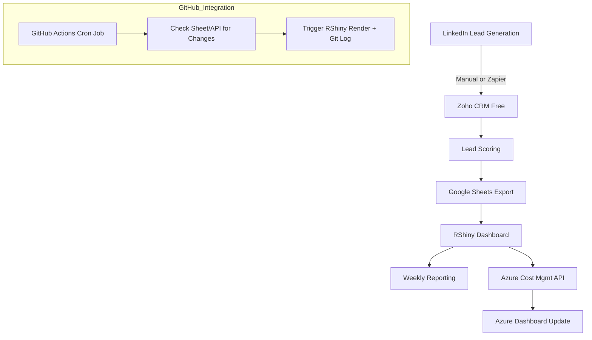

# 🧭 Founder Survival Plan – Day 2: Mastering Complexity

## 💡 Inspired by IMD’s Foundations for Business Leadership

**Curated by:** Erwin Maurice McDonald
**Goal:** Simulate elite executive training for AI-driven founders navigating volatility and capital pressure.

---

## 🎯 Day 2 Focus: Leading Through Uncertainty & Volatility

### Objective

Strengthen strategic agility in complex business environments and operate confidently under capital constraints while sustaining client success and technical continuity.

---

## 📅 Week-by-Week Roadmap: Lean & Strategic

### **Week 1: Fast Foundations**

* **AI Content & Messaging**

  * Use ChatGPT or Claude (free) to draft authentic LinkedIn posts, blogs, and short videos about solo learning, tech survival, and ethical leadership.
* **Affordable CRM Setup**

  * Sign up for HubSpot CRM Free or Zoho CRM Free.
  * Add lead capture forms to social media profiles and emails.
* **Social to Lead Conversion**

  * Use Buffer or Hootsuite Free to schedule 3–4 weekly social media posts with CTAs.

### **Week 2–3: Outreach & Workflow**

* Create drip email sequences with MailerLite Free or Zoho Campaigns Free.
* Implement lead tracking with CRM categories: Cold, Warm, Hot.
* Automate scheduling using Calendly Basic or Google Calendar slots.

### **Week 4: Loan & Pitch Crafting**

* **Develop 1-page strategic memo:**

  * Highlight founder story, active clients, use of lean AI stack.
  * Request \$5–10K for AI-driven outreach.

**Sample Pitch Paragraph:**

> As a veteran-led and tech-savvy consultancy with active client contracts and six months of cash runway, we request a \$5–10K microloan to invest in AI-enabled content development and lead capture. Our lean model, ethical leadership, and commitment to client deliverables position us to scale responsibly—with measurable performance and transparency.

### **Week 5: Efficiency Stack**

* Tools:

  * Azure Cost Management Free
  * GitHub Actions
  * Zapier Free
  * Google Sheets (RShiny dashboard integration preferred)
* Track deliverables, forecast runway, and share weekly updates with stakeholders.

### **Week 6: Thought Leadership & Launch**

* Publish long-form content (LinkedIn, Medium) on quiet growth and client delivery.
* Launch short explainer video about your lean AI-powered model.
* Offer free 15-minute consults to warm leads using Calendly.

---

## 🛠️ Tools Overview

| Function          | Tool                        | Purpose                                 |
| ----------------- | --------------------------- | --------------------------------------- |
| CRM               | HubSpot / Zoho CRM          | Lead management & pipeline tracking     |
| Email Automation  | MailerLite / Zoho Campaigns | Drip emails & campaign management       |
| Social Scheduling | Buffer / Hootsuite          | Schedule regular value-driven content   |
| Booking           | Calendly / Gmail            | Schedule intro consults                 |
| Automation        | Zapier Free                 | Workflow automation                     |
| Cost Monitoring   | Azure Cost Management       | Monitor and reduce cloud spend          |
| DevOps Automation | GitHub Actions              | Automated deploy and CI/CD              |
| Forecasting       | Google Sheets + RShiny      | Visualize financial and pipeline health |

---

## 🔁 AI Prompt Snippets

**1. Content/Post Prompt**

```
Write an honest LinkedIn post (~200 words) from a founder surviving a downturn: share a real challenge, what you learned, and what you offer clients now. Tone: humble, helpful, strong.
```

**2. Cold Email Prompt**

```
Generate a 3-step outreach sequence: connection request, follow-up with a value piece, and scheduling ask. Should sound human, not spammy.
```

**3. Memo Prompt**

```
Write a professional memo to a lender/advisory board: outline current cash runway (6 months), active clients, AI and marketing plan, and how requested microloan will be used.
```

---

## 🔍 Key Takeaways

* Stretch your runway through ethical automation and lean design
* Generate leads by building trust, not hype
* Use your founder journey as the content — experience is the asset
* Stay visible, disciplined, and transparent in your communication

---

## 🔧 LeadSync Ops – Technical Parameters

* **Zoho CRM Access:** Manual API token authentication
* **RShiny Hosting:** shinyapps.io
* **GitHub Actions Sync Interval:** Hourly (cron: '0 \* \* \* \*')
* **Failure Notifications:** Trigger email alert on sync failure
* **Azure Cost Integration:** Planned for future financial readiness

---

## 🗂️ Windows File Explorer Folder Structure

```
C:/LeadSyncOps/
├── config/
│   └── zoho_keys.json            # Zoho CRM API access tokens & settings
├── data/
│   └── leads_google_sync.csv     # Periodic exports of lead data
├── logs/
│   └── sync_log.txt              # GitHub Action sync events and timestamps
├── zoho_api/
│   └── zoho_pull_script.R        # R script to pull CRM leads via Zoho API
├── RShinyApp/
│   ├── app.R                     # Main Shiny app
│   ├── modules/                  # Expandable R modules (e.g., filtering, analytics)
│   └── www/                      # Static assets (CSS, JS, images)
├── github-actions/
│   └── .github/
│       └── workflows/
│           └── update_dashboard.yml  # Workflow config
└── README.md                     # This overview and diagram
```

---

## 📍 Location & Time

Dallas, TX · Summer 2025
Simulated Strategic Exercise – Day 2

---

## 🧠 System Workflow: Azure + GitHub Actions + Zoho CRM (No PowerBI, RShiny Preferred)



### Summary:

* **Zoho CRM** collects and organizes LinkedIn leads.
* **Google Sheets** acts as an intermediary, syncing leads to an **RShiny dashboard** for real-time monitoring.
* **Azure Cost Management** is optionally polled to align tech spend with CRM activity.
* **GitHub Actions** automate checks for new lead data and trigger RShiny rebuilds or log updates.
* All of this can run without PowerBI or Dynamics 365, keeping costs low and tools familiar.
